# CodeGram-MW: 악성코드 탐지 및 이모지 태깅 서비스

## 🚀 프로젝트 개요

`CodeGram-MW`는 소스코드의 잠재적 악성 행위를 탐지하고, 코드의 내용과 관련된 이모지를 자동으로 태깅하는 FastAPI 기반의 웹 서비스입니다. 이 프로젝트는 정적 코드 분석, 언어 감지, 리소스 고갈 패턴 탐지, 그리고 OpenAI LLM(Large Language Model)을 활용한 고급 이모지 태깅 기능을 결합하여 코드의 안전성과 의미를 동시에 분석합니다.

## ✨ 주요 기능

*   **다국어 소스코드 분석**: Python, C, C++, Java 등 다양한 프로그래밍 언어의 소스코드를 분석합니다.
*   **악성코드 위험도 평가**: `eval`, `exec`, `system()` 호출, 무한 루프, 대규모 메모리 할당, 파일 시스템 접근 등 잠재적으로 위험한 코드 패턴을 탐지하고 위험도 점수를 산정합니다.
*   **동적 리소스 제한 제안**: 코드의 위험도 점수에 따라 CPU 시간, 메모리 사용량 등 실행 환경에 대한 동적인 리소스 제한을 제안하여 안전한 코드 실행을 돕습니다.
*   **지능형 이모지 태깅**: OpenAI LLM을 활용하여 코드의 맥락을 이해하고, 가장 적절한 이모지를 추천합니다. OpenAI API 호출 실패 시에는 로컬 규칙 기반 태거로 안전하게 폴백(fallback)합니다.
*   **확장 가능한 탐지 규칙**: 언어별 탐지 규칙(`python_rules.py`, `c_rules.py` 등)과 범용 리소스 탐지 규칙(`resource_utils.py`)을 모듈화하여 새로운 위험 패턴에 대한 확장이 용이합니다.

## 🛠️ 기술 스택

*   **백엔드 프레임워크**: FastAPI
*   **언어**: Python 3.9+
*   **데이터 유효성 검사**: Pydantic
*   **코드 분석**: Python `ast` 모듈, 정규 표현식 (`re`)
*   **AI/ML**: OpenAI API (LLM 기반 이모지 태깅)
*   **컨테이너**: Docker

## 🏗️ 아키텍처

`CodeGram-MW`는 FastAPI를 중심으로 구성된 마이크로서비스 아키텍처를 따릅니다. 클라이언트의 코드 분석 요청은 FastAPI 애플리케이션의 `/v1/analyze` 엔드포인트를 통해 처리됩니다. 요청된 코드는 언어 감지 모듈을 거쳐 해당 언어에 특화된 탐지 규칙과 범용 리소스 탐지 규칙에 의해 분석됩니다. 동시에, 이모지 태깅 모듈은 OpenAI LLM 또는 로컬 규칙을 사용하여 코드에 적합한 이모지를 부여합니다. 최종적으로, 분석된 위험도 점수를 기반으로 의사결정 로직이 실행 여부와 리소스 제한을 결정하고, 모든 결과를 통합하여 클라이언트에 응답합니다.

아래 클래스 다이어그램은 프로젝트의 주요 모듈과 그 관계를 시각적으로 보여줍니다.


### 클래스 다이어그램 (Mermaid 코드)

```mermaid
classDiagram
    %% 메인 애플리케이션 클래스
    class FastAPIApp {
        +FastAPI app
        +str APP_VERSION
        +health() dict
        +analyze(req: AnalyzeRequest) AnalyzeResponse
    }

    %% Pydantic 스키마 클래스
    class AnalyzeRequest {
        +str code
        +str language
    }

    class AnalyzeResponse {
        +bool safe
        +int risk_score
        +str decision
        +str language
        +List~str~ blocked_rules
        +List~str~ reasons
        +Dict~str,int~ suggested_limits
        +List~str~ emojis
        +List~str~ emoji_labels
        +List~str~ emoji_ids
        +List~str~ tags
        +Dict~str,Any~ style
        +str version
        +Optional~bool~ fallback_used
        +Optional~Dict~ openai_usage
    }

    %% 스코어링 및 의사결정 클래스
    class ScoringModule {
        +decision_logic(score: int) Tuple
        +suggest_limits(score: int, lang: str) Dict
    }

    %% 유틸리티 클래스
    class UtilsModule {
        +comment_ratio(code: str) float
        +avg_function_len_python(tree: AST) float
    }

    %% 베이스 탐지기 클래스
    class BaseDetector {
        +make_result(score: int, reasons: List, blocked: List, style: Dict, hard_block: bool) Dict
    }

    %% 언어 감지 클래스
    class LanguageDetector {
        +Dict LANG_HINTS
        +detect_language(code: str, hint: str) str
    }

    %% Python 규칙 분석기
    class PythonRulesAnalyzer {
        +List GENERIC_FORBIDDEN
        +Dict PY_FORBIDDEN_IMPORTS
        +analyze_python(code: str) Dict
    }

    %% 범용 규칙 분석기
    class GenericRulesAnalyzer {
        +List GENERIC_FORBIDDEN
        +analyze_generic(code: str) Dict
    }

    %% C 규칙 분석기
    class CRulesAnalyzer {
        +List C_FORBIDDEN
        +analyze_c(code: str) Dict
    }

    %% C++ 규칙 분석기
    class CppRulesAnalyzer {
        +List CPP_FORBIDDEN
        +analyze_cpp(code: str) Dict
    }

    %% Java 규칙 분석기
    class JavaRulesAnalyzer {
        +List JAVA_FORBIDDEN
        +analyze_java(code: str) Dict
    }

    %% 리소스 유틸리티 클래스
    class ResourceUtils {
        +List INFINITE_LOOP_PATTERNS
        +List LARGE_ALLOC_PATTERNS
        +str IO_IN_LOOP_SNIPPET
        +List PROCESS_THREAD_PATTERNS
        +List FILE_WRITE_PATTERNS
        +str RECURSION_SNIPPET
        +detect_infinite_loop(code: str) Tuple
        +detect_large_alloc(code: str) Tuple
        +detect_io_in_loop(code: str) Tuple
        +detect_proc_thread_spawn(code: str) Tuple
        +detect_file_write_patterns(code: str) Tuple
        +detect_recursion(code: str) Tuple
        +run_all_resource_checks(code: str) Tuple
    }

    %% 로컬 이모지 태거
    class LocalEmojiTagger {
        +Dict EMOJI_MAP
        +Dict KEYWORD_MAP
        +Set COMMON_IGNORE
        +_ast_extract(code: str) Dict
        +_regex_extract(code: str) Dict
        +map_emojis(code: str, top_n: int) Dict
    }

    %% OpenAI 이모지 태거
    class OpenAIEmojiTagger {
        +List ALLOWED_EMOJI
        +Set ALLOWED_IDS
        +str PROMPT_TEMPLATE
        +List SECRET_PATTERNS
        +OpenAI _client
        +mask_secrets(code: str) str
        +_extract_first_json(text: str) Optional~str~
        +_resp_text_from_response(resp) Optional~str~
        +ask_gpt_for_emojis(code: str, model: str, timeout: int, max_output_tokens: int) Dict
        +get_openai_emojis_safe(code: str, local_fallback_callable) Dict
    }

    %% 관계 정의
    FastAPIApp --> AnalyzeRequest : receives
    FastAPIApp --> AnalyzeResponse : returns
    FastAPIApp --> LanguageDetector : uses
    FastAPIApp --> PythonRulesAnalyzer : uses
    FastAPIApp --> GenericRulesAnalyzer : uses
    FastAPIApp --> OpenAIEmojiTagger : uses
    FastAPIApp --> LocalEmojiTagger : uses (fallback)
    FastAPIApp --> ScoringModule : uses

    PythonRulesAnalyzer --> BaseDetector : uses
    PythonRulesAnalyzer --> UtilsModule : uses
    PythonRulesAnalyzer --> ResourceUtils : uses

    GenericRulesAnalyzer --> BaseDetector : uses

    CRulesAnalyzer --> BaseDetector : uses
    CRulesAnalyzer --> ResourceUtils : uses

    CppRulesAnalyzer --> BaseDetector : uses
    CppRulesAnalyzer --> ResourceUtils : uses

    JavaRulesAnalyzer --> BaseDetector : uses
    JavaRulesAnalyzer --> ResourceUtils : uses

    OpenAIEmojiTagger --> LocalEmojiTagger : fallback
```



## 📂 주요 모듈 및 컴포넌트

| 파일 경로 | 모듈 구분 | 역할 및 상세 설명 |
| :--- | :--- | :--- |
| `app/main.py` | 메인 애플리케이션 | **FastAPI 엔트리포인트.** FastAPI 인스턴스를 생성하고, `/v1/analyze` 엔드포인트를 통해 코드 분석 및 이모지 태깅 로직을 통합하여 실행합니다. |
| `app/schemas.py` | 데이터 모델 | 요청(`AnalyzeRequest`) 및 응답(`AnalyzeResponse`)에 사용되는 Pydantic 스키마를 정의합니다. |
| `app/scoring.py` | 분석 로직 | 위험도 점수를 기반으로 최종 결정("allow", "sandbox", "block")을 내리고, 코드 실행 시 적용할 리소스 제한을 동적으로 제안합니다. |
| `app/utils.py` | 유틸리티 | Python 코드의 주석 비율(`comment_ratio`) 및 평균 함수 길이(`avg_function_len_python`) 등 코드 스타일 분석에 필요한 보조 함수를 제공합니다. |
| `app/detectors/base.py` | 탐지기 기본 | 모든 탐지기 모듈이 공통으로 사용하는 표준 결과 딕셔너리 생성 함수(`make_result`)를 정의합니다. |
| `app/detectors/lang_detect.py` | 탐지기 | 코드의 키워드 힌트를 기반으로 프로그래밍 언어를 식별하는 언어 감지 모듈입니다. |
| `app/detectors/python_rules.py` | 탐지기 | Python 언어에 특화된 정규식 및 AST 기반의 위험 패턴(동적 실행, 위험 모듈 임포트 등)을 탐지하고 점수를 부여합니다. |
| `app/detectors/generic_rules.py` | 탐지기 | 언어에 관계없이 적용 가능한 일반적인 위험 패턴(예: `eval`, `exec`, `fork`)을 탐지합니다. |
| `app/detectors/c_rules.py` | 탐지기 | C 언어에 특화된 위험 패턴(예: `system()`, `popen()`, `fork()`)을 탐지합니다. |
| `app/detectors/cpp_rules.py` | 탐지기 | C++ 언어에 특화된 위험 패턴(예: `std::thread`, `malloc`)을 탐지합니다. |
| `app/detectors/java.rules.py` | 탐지기 | Java 언어에 특화된 위험 패턴(예: `Runtime.exec`, `ProcessBuilder`, `ServerSocket`)을 탐지합니다. |
| `app/detectors/resource_utils.py` | 탐지기 | 무한 루프, 대규모 메모리 할당, 반복적인 I/O 등 리소스 사용에 관련된 위험 패턴을 정규식으로 탐지합니다. |
| `app/emoji/tagger.py` | 이모지 태깅 | **로컬 태거.** AST 기반 분석 및 키워드 매핑을 통해 코드의 주제와 관련된 이모지를 로컬에서 추천합니다. OpenAI API 실패 시 폴백으로 사용됩니다. |
| `app/emoji/openai_tagger.py` | 이모지 태깅 | **OpenAI 태거.** OpenAI LLM을 활용하여 코드의 맥락을 분석하고 이모지를 추천합니다. API 호출 전 민감 정보를 마스킹하고, 실패 시 로컬 태거로 안전하게 폴백하는 로직을 포함합니다. |

## ⚙️ 설치 및 실행

### 1. 가상 환경 설정 및 의존성 설치

```bash
python3 -m venv .venv && source .venv/bin/activate
pip install -r requirements.txt
```

### 2. 서비스 실행

```bash
uvicorn app.main:app --host 0.0.0.0 --port 8080
```

### 3. Docker를 이용한 실행

```bash
docker build -t malware-emoji:0.1 .
docker run -d --name malware-emoji -p 8080:8080 malware-emoji:0.1
```

### 4. 헬스 체크

```bash
curl http://localhost:8080/health
```
